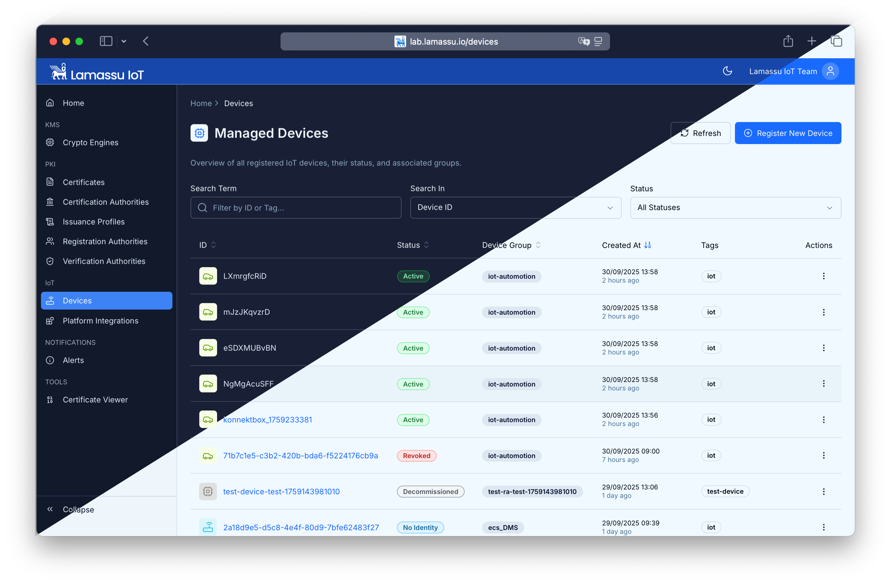
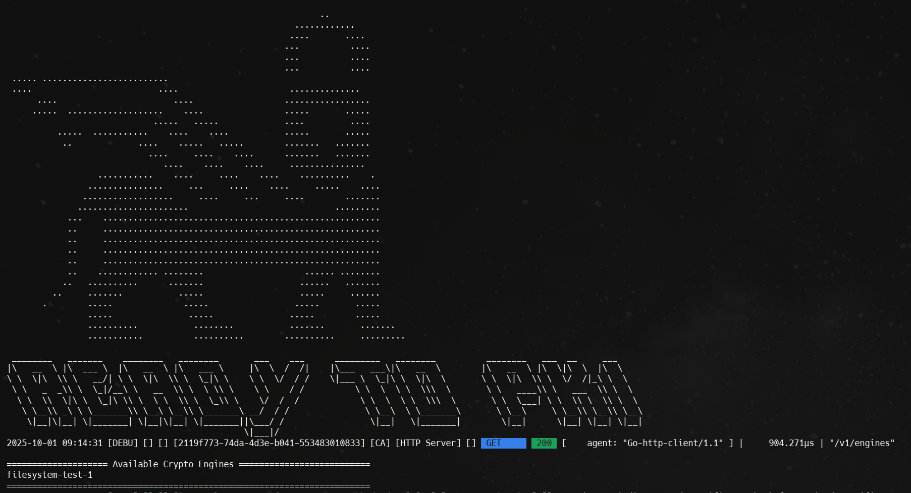

# Lamassu IoT
[](https://codecov.io/gh/lamassuiot/lamassuiot)


Lamassu IoT is an IoT-first public key infrastructure (PKI) platform built for industrial environments, enabling secure device
identities, automated certificate lifecycles, and integration with cloud and edge ecosystems. This repository hosts the source
code, infrastructure components, and SDKs that power Lamassu deployments.




## Why Lamassu IoT?

- **Industrial-grade security** – Hardened crypto engines, hardware-backed key storage, and auditable certificate workflows.
- **Cloud & edge ready** – Pluggable storage, event bus, and crypto layers support AWS, Vault, on-premises, and hybrid setups.
- **Operational automation** – Device onboarding, policy management, and renewal flows designed for large IoT fleets.
- **Developer friendly** – SDKs, connectors, and well-defined APIs accelerate integrations with existing platforms.

## Codebase organization 

There are 3 main repositories to consider when developing Lamassu

- **Backend**: This repository (`lamassuiot/lamassuiot`) - Core services, APIs, domain logic and SDKs components
- **Dashboard**: [lamassuiot/lamassu-ui](https://github.com/lamassuiot/lamassu-ui) - React-based web interface for managing CAs, certificates, devices, and system configuration
- **Helm Charts**: [lamassuiot/lamassu-helm](https://github.com/lamassuiot/lamassu-helm) - Kubernetes deployment manifests and Helm charts for production environments


## Repository layout

| Path | Description |
| ---- | ----------- |
| [`backend/`](backend/) | Domain services (CA, device manager, alerts, etc.) powering Lamassu IoT. |
| [`connectors/`](connectors/) | Integrations with cloud providers (e.g., AWS IoT) and external systems. |
| [`core/`](core/) | Shared business logic, domain models, and cross-service utilities. |
| [`engines/`](engines/) | Modular crypto, storage, filesystem, and event bus adapters. |
| [`monolithic/`](monolithic/) | Monolithic build option for simplified deployments and demos. |
| [`sdk/`](sdk/) | Language-specific tooling for interacting with Lamassu APIs and services. |
| [`shared/`](shared/) | Common libraries for HTTP, AWS helpers, and subsystem orchestration. |
| [`ci/`](ci/) | Continuous integration workflows and automation scripts. |

## Getting started

### Prerequisites

- [Go 1.24+](https://go.dev/doc/install)
- Docker (for running dependencies such as PostgreSQL, Vault, or message brokers)
- Kubernetes cluster (optional, recommended for production deployments)

### Clone & bootstrap

```bash
# Clone the repository
 git clone https://github.com/lamassuiot/lamassuiot.git
 cd lamassuiot

# Synchronize go.work modules and tidy dependencies
 go work sync
 go mod tidy -e ./...

# Run the full test suite
 go test ./...
```

> **Tip:** The repository uses a Go workspaces file (`go.work`) to orchestrate the multiple modules located under
> `backend`, `connectors`, `core`, `engines`, `sdk`, and `shared`.

### Running services locally - Development

Running all Lamassu Services all-in-one is as easy as running the following command. Bare in mind that `docker` is a requirement. The monolithic launcher runs and configures the required infrastructure (i.e. postgres, rabbitmq) as docker containers. To run it, exec the command:

```bash
go run ./monolithic/cmd/development/main.go
```

Once the app is ready the following logs will appear:



The UI and API is now being served at (to access the API, add `/api` to the URL path): 

```
http://localhost:8080
https://localhost:8443
```

For production deployments and Helm charts, refer to the [official documentation](https://www.lamassu.io/docs/).

## Contributing

We welcome community contributions! To get started:

1. Review the [CONTRIBUTING.md](CONTRIBUTING.md) guidelines.
2. Open an issue describing your proposal or bug report.
3. Submit a pull request with a focused change set and accompanying tests.

Please adhere to our coding standards, commit conventions, and security practices outlined in
[SECURITY.md](SECURITY.md).

## Support & community

- 📚 Documentation: https://www.lamassu.io/docs/
- 🐛 Issues: [GitHub Issues](https://github.com/lamassuiot/lamassuiot/issues)
- 💬 Discussions: [GitHub Discussions](https://github.com/lamassuiot/lamassuiot/discussions)

## License

This project is licensed under the [Mozilla Public License Version 2.0](LICENSE).